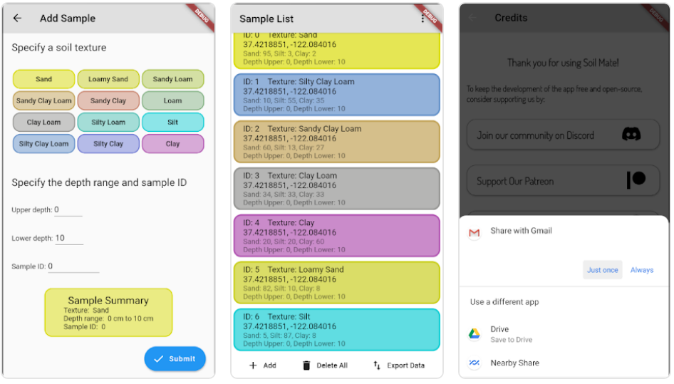

# Soil Mate
## *Helper app designed to assist the collection of soil data.*

The soil mate app provides a simple and convenient way to collect soil data at sample locations in the field. The Soil Mate app is targeted across multiple industries, including agriculture, environmental science, geology, and mining. The current version of the app collects soil texture data.



Read about the app in this [article](https://open-source-agriculture.github.io/2021-01-09-soil-mate-texture-app/)

## Getting Started

### install Flutter

Install dependencies:

```
sudo apt install curl
```

Get flutter (copy in all lines, run from home the location you want to install flutter):

```bash
git clone https://github.com/flutter/flutter.git -b stable && \
echo '#Add Flutter to PATH' >> $HOME/.bashrc && \
echo 'export PATH="$PATH:'$(pwd)'/flutter/bin"' >> $HOME/.bashrc && \
export PATH="$PATH:$(pwd)/flutter/bin" && \
echo "Check the flutter is in path" && \
echo $PATH && \
flutter precache && \
echo "Check your dependencies:" && \
flutter doctor
```


### install Android Studio (optional)

Download and install Android Studio and install the Flutter and dart plugins:

Run `flutter doctor` again to check dependencies.

### install the project

Clone the repo:

```
git clone https://github.com/Open-Source-Agriculture/soil_mate/
```

Get dependencies:

```
flutter pub get
```

### run the project

Connect your device or emulator, then run:

```
flutter run
```

Or use the run button on your IDE.

## Contributing 

To contribute to the **Soil Mate** app, make a fork to add your change to, then make a *Pull Request*.

A list of tasks may be found on our [Project Board](https://github.com/Open-Source-Agriculture/soil_mate/projects/1)

## Join us


Chat to us on [Discord](https://discord.gg/8x58DuxfGz) 

